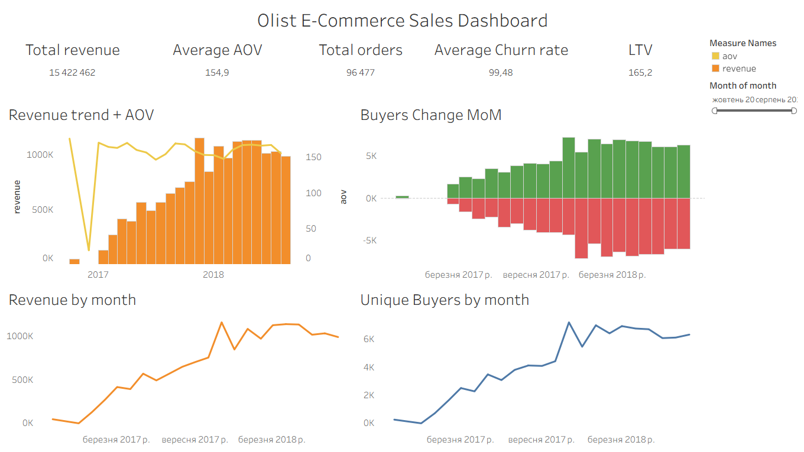

# 🛒 E-Commerce Sales & Customer Retention Dashboard

An end-to-end business intelligence project analyzing 2+ years of Brazilian e-commerce transaction data (Olist dataset) to monitor sales performance and customer retention dynamics.

## 📊 Dashboard

🔗 **[View Live Dashboard on Tableau Public](https://public.tableau.com/)**



---

## 🎯 Objective

To provide product management with a clear view of revenue drivers, buyer churn, and customer lifetime value — transforming raw transactional data into actionable business insights.

---

## 🛠️ Tech Stack

| Tool | Usage |
|---|---|
| PostgreSQL | Data storage & querying |
| SQL (CTEs, Window Functions) | Metric calculation |
| Tableau Public | Interactive dashboard |

---

## 📐 Metrics Calculated

**Sales Metrics**
- Gross Revenue — total monthly revenue from delivered orders
- Orders Count — number of completed orders per month
- AOV (Average Order Value) — `Revenue / Orders`
- Unique Buyers — distinct customers per month

**Retention Metrics**
- New Buyers — customers making their first purchase in a given month
- Returning Buyers — customers who purchased in both current and previous month
- Churned Users — customers who purchased last month but not this month
- Churn Rate — `Churned Users(M) / Unique Buyers(M-1)`
- Retention Rate — `Returning Buyers(M) / Unique Buyers(M-1)`

**Unit Economics**
- LTV (Lifetime Value) — average total revenue per customer over their lifetime

---

## 🗃️ Data Source

**Brazilian E-Commerce Public Dataset by Olist** — available on [Kaggle](https://www.kaggle.com/datasets/olistbr/brazilian-ecommerce)

Tables used:
- `olist_orders_dataset.csv` — orders and statuses
- `olist_order_payments_dataset.csv` — payment amounts
- `olist_order_items_dataset.csv` — items per order
- `olist_customers_dataset.csv` — customer data
- `olist_products_dataset.csv` — product categories

> Only orders with status `delivered` were included in the analysis.

---

## 🧠 Key SQL Techniques

- **CTEs (Common Table Expressions)** — modular query structure across 6+ chained CTEs
- **Window Functions** — `LAG()` and `LEAD()` for sequential purchase history analysis to classify buyers as New, Returning, or Churned
- **Conditional Aggregation** — `COUNT(CASE WHEN ...)` for multi-dimensional buyer segmentation in a single query

---

## 📈 Key Findings

- **Average Churn Rate ~99%** — the vast majority of customers make only one purchase, revealing a one-time purchase behavior typical for this market
- **Black Friday Effect** — clear revenue spike in November 2017 (+37% vs October 2017)
- **Consistent AOV** — average order value remained stable at ~$150-175 throughout the entire period despite significant volume growth
- **LTV = $165.20** — average total revenue per customer over their lifetime

---

## 📁 Repository Structure

```
olist-ecommerce-dashboard/
│
├── README.md
└── sql/
    └── final_metrics.sql    # All metric calculations
```

---

## 👤 Author

**Your Name**
[LinkedIn](https://linkedin.com/in/yourprofile) · [Tableau Public](https://public.tableau.com/)
